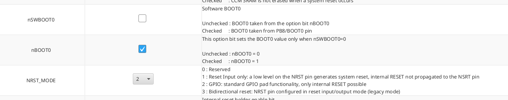

# This is a project to train with myself, it is not tutorial

## Needed instuments on your PC

### gcc and g++

Debian-based (Ubuntu, Debian,...)

```sh
sudo apt update
sudo apt install -y gcc g++
```

RHEL (Fedora, Red Hat)

```sh
sudo dnf install -y gcc gcc-c++
```

### Make

Debian-based (Ubuntu, Debian,...)  

```sh
sudo apt install -y make
```

RHEL (Fedora, Red Hat)

```sh
sudo dnf install -y make
```

### CMake

All this project based on CMake, so you have to have it, you can install it via commands below.

Debian-based (Ubuntu, Debian,...)  

```sh
sudo apt install -y cmake
```

RHEL (Fedora, Red Hat)

```sh
sudo dnf install -y cmake
```

## gcc-arm-none-eabi

``` sh
apt install gcc-arm-none-eabi
```

### ST-Link

I have added a simlple cmake target to flash MCU via STM32CubeProgramerCLI. You can download it [here](https://www.st.com/en/development-tools/stm32cubeprog.html).

### Ninja build (recomended)

Debian-based (Ubuntu, Debian,...)  

``` sh
sudo apt install -y ninja-build
```

RHEL (Fedora, Red Hat)

```sh
sudo dnf install -y ninja-build
```

### Doker (for test running)

Debian-based (Ubuntu, Debian,...)  

```sh
sudo apt update
sudo apt install -y docker.io
sudo systemctl enable --now docker
sudo usermod -aG docker $USER
```

RHEL (Fedora, Red Hat)

```sh
sudo dnf install -y docker
sudo systemctl enable --now docker
sudo usermod -aG docker $USER
```

## Notes

* For correct working with PCB from repository [link]( https://oshwlab.com/parasolka_jeck/rc_car_controller) you must setup your STM32G431
    * Set parameter nSWBOOT0 to uncheked (checked by default)
    * Set NRST_Mode to 2 (port used as usual GPIO without nRESET feature)

It must look like in picture 

## License

This project is licensed under the [MIT License](LICENSE).
