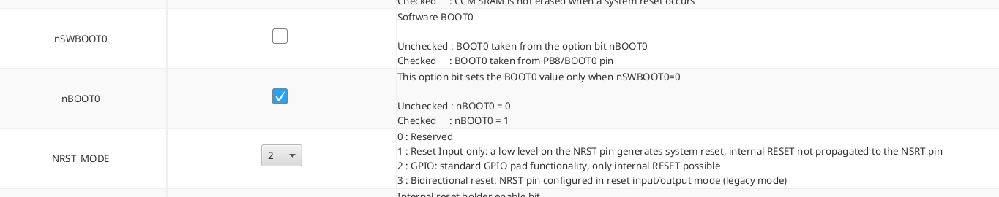

# This is a project to train with myself, it is not tutorial

## Needed instuments on your PC

### gcc and g++

Debian-based (Ubuntu, Debian,...) 
```
sudo apt update
sudo apt install -y gcc g++
```
RHEL (Fedora, Red Hat)
```
sudo dnf install -y gcc gcc-c++
```
### Make

Debian-based (Ubuntu, Debian,...)  
```
sudo apt install -y make
```
RHEL (Fedora, Red Hat)
```
sudo dnf install -y make
```

### CMake
All this project based on CMake, so you have to have it, you can install it 

Debian-based (Ubuntu, Debian,...)  
```
sudo apt install -y cmake
```
RHEL (Fedora, Red Hat)
```
sudo dnf install -y cmake
```

### ST-Link

I have added a simlple cmake target to flash 

```
wget -O stlink.tar.gz https://github.com/stlink-org/stlink/releases/latest/download/stlink-1.7.0-Linux.tar.gz
tar -xzf stlink.tar.gz -C /usr/local
sudo ln -s /usr/local/stlink/bin/st-* /usr/local/bin/
```

```
sudo dnf install -y stlink
```

### Ninja build (recomended)

Debian-based (Ubuntu, Debian,...)  
```
sudo apt install -y ninja-build
```
RHEL (Fedora, Red Hat)
```
sudo dnf install -y ninja-build
```

### Doker (for test running)

Debian-based (Ubuntu, Debian,...)  
```
sudo apt update
sudo apt install -y docker.io
sudo systemctl enable --now docker
sudo usermod -aG docker $USER
```
RHEL (Fedora, Red Hat)
```
sudo dnf install -y docker
sudo systemctl enable --now docker
sudo usermod -aG docker $USER
```

## Notes

* For correct working with PCB from repository [link]( https://oshwlab.com/parasolka_jeck/rc_car_controller) you must setup your STM32G431
    * Set parameter nSWBOOT0 to uncheked (checked by default)
    * Set NRST_Mode to 2 (port used as usual GPIO without nRESET feature)

It must look like in picture 


## License
This project is licensed under the [MIT License](LICENSE).